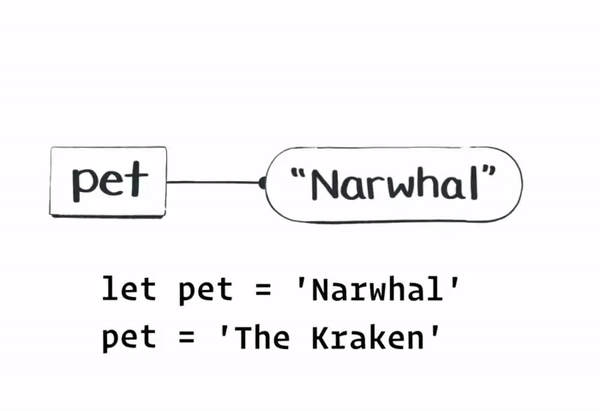

# PUDT 3101 - Fall 2022

This is a guide about prerequisite knowledge that you should have for `PUDT 3101` Fall 2022. This guide will cover:

1. `console.log`
2. variables and constants

## Logging to the Console --> Recipe: Finding the Value of a Variable at a Specific Point in Time

Every application has two things: data and behavior. The challenge that you'll face over and over, again, is when you're trying to take data that you already have and transform it into something else.

**Keep this in Mind**: There's a big difference between variables and values. Variables are some type of data (e.g. strings, numbers, arrays, objects) that is declared and then assigned to a value. Challenges arise when we re-assign the value of a variable.

Imagine that a variable is a wire to value.

Let's take the following block of code:

```
console.log(pet);
let pet = 'Narwhal';
console.log(pet)
pet = 'The Kraken';
console.log(pet);
```

_Source_: Just JavaScript by Dan Abramov and Maggie Appleton.

What will happen when we log `pet` to the console? (Note: We are logging `pet` three times on lines 1, 3 and 5)

1. The first time we will log out `undefined` because we have not declared the variable `pet` yet. JavaScript executes code line-by-line (remember the thread of execution) so we check our memory and don't find the value and therefore, we say that `pet` is `undefined` or in some cases we will get a big red error message. Take this as a sign, that you're trying to access a variable that hasn't been declared yet, and that you need either: declare the variable earlier in your execution context or you need to move where you're accessing the variable to somewhere later (further down) in your execution context.
2. The second time we will log out `Narwal`.
3. The third time we will log out `The Kraken`.



### Anatomy of Variable Assignment

`let leftSide = 'right ' + 'side';`

The left side of every variable assignment must be a "wire" (properly known as an "identifier"). Meaning it must be a valid way for us to declare (or re-assign) a variable.

The right side of every variable assignment must be an "expression". An expression always _evaluates_ to a value. In this case `'right ' + 'side'` evaluates to `right side`.

#### 10 Crack Commandments for Variable Assignment

1. Variables are case-sensitive. Meaning that the following variables `leftSide` and `LeftSide` will be two different variables in memory.
2. Use `camelCase` for variable names. So if we're going to make a variable and name it after the greatest artists (resting or alive): Kanye Omari West. Then we'd name the variable as `kanyeOmariWest`.
3. Variables cannot begin with a number. Trying to name a variable `1array` will throw an error. However, `array1` is a valid variable identifier.
4. Variables may not have a symbol in them. The following variable name will throw an error `array-1`.
5. Try to never assign a variable using `var` until you fully understanding the concept of hoisting.
6. Only assign a variable using `let` if you intentionally know that the variable's value will not be re-assigned.
7. A `const` variable may never have its value re-assigned. But keep in mind that the value of an object is not the content's of the object (e.g. `const jai = {isCool: true}`) instead its the reference in the computer's memory. Therefore if we later add a property to an object who's variable was declared using `const`, we can still add properties to the value (e.g. `jai["isGoodProfessor"] = true'`.
8. Two variables cannot have the same name if they're in the same execution context. If they're in the same scope, you'll get an error, if we open a new execution context inside (by invoking a function) then the function's variable will be the variable that we reference (no error will be throw).
9. We don't pass variables to functions. We pass the value of a variable at a point in time (the thread of execution).

```
function double(x) {
  x = x * 2;
}

let money = 10;
double(money);
console.log(money); // ?
```

_Money will log out to `10`._

If we thought `double(money)` was passing a variable, we could expect that `x = x * 2` would double the money variable.

But that’s not right: `double(money)` means “figure out the value of money, and then pass that value to double.” So money still points to `10`.

10. JavaScript has funky behavior with expressions because its a forgiving language. Take the following code block:

```
const count = 101;
let pet = ' dalmations`;
pet = count + pet;
console.log(pet);
```

_What will this log_: This will log out "101 dalmations".

JavaScript is a forgiving language, that if we have an expression with two different data types like in this case of a `string` and a `number`. Then JavaScript will just convert the `number` into a `string` instead of throwing an error. Use the `typeof` operator when you're logging variables and notice that you're not getting the value that you're expecting.
